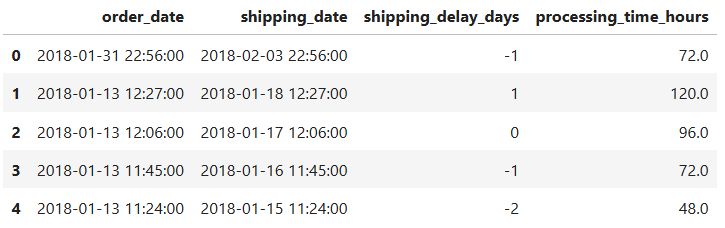
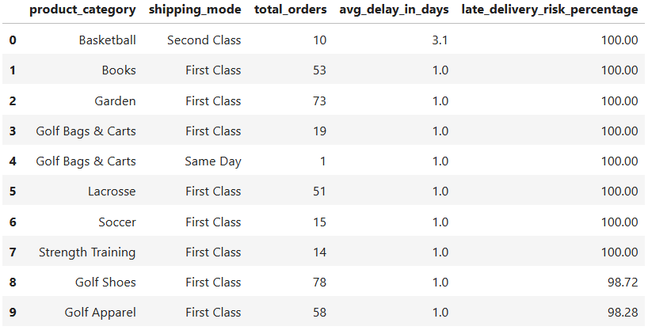
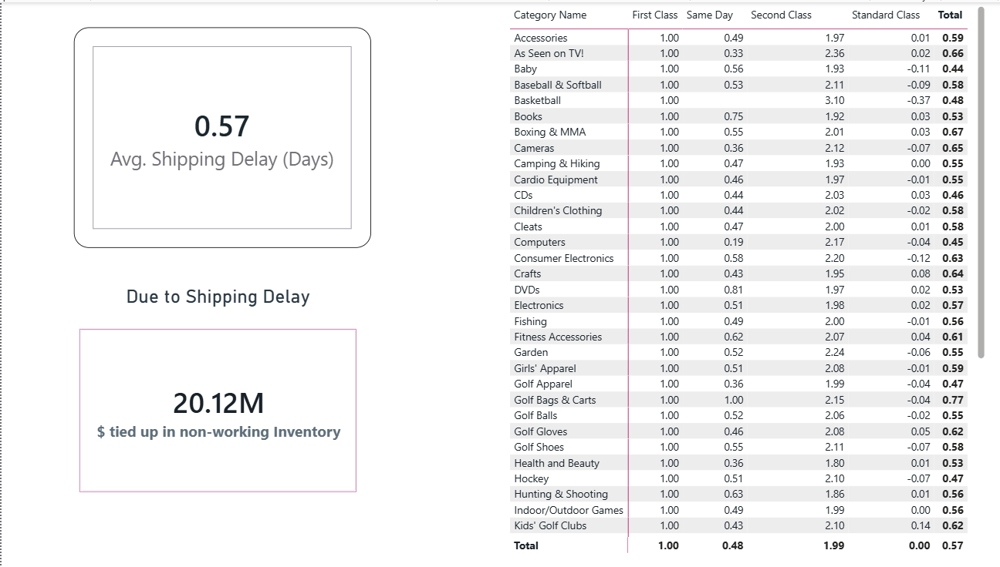
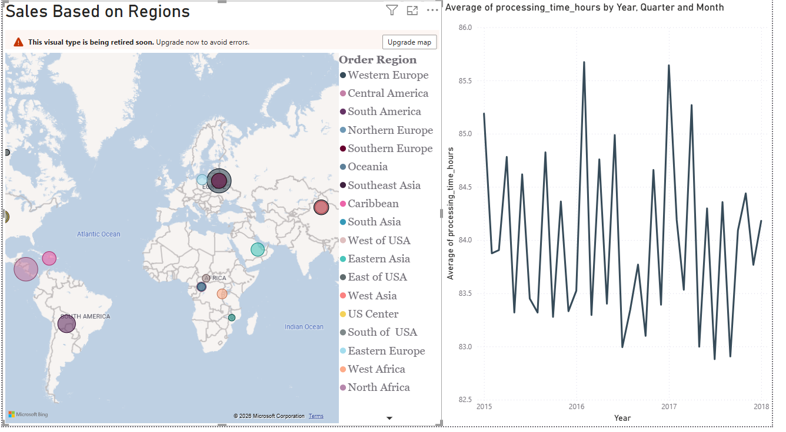

# Supply Chain Operational Risk & Inventory Optimization

This project outlines an end-to-end data analysis pipeline designed to analyze material flow, simulate procurement forecasting, and reduce late deliveries. By combining Python, SQL, and Power BI, this analysis establishes standard work principles and culminates in a Lean Six Sigma DMAIC framework.

---

## Phase 1: Project Definition & Framework
Before touching any code, the structural foundation was set to prove the application of Lean Six Sigma methodologies.

* **The DMAIC Markdown Document:** Created the repository structure and defined the core problem. The objective is to analyze material flow and simulate procurement forecasting to improve service levels and reduce late deliveries using standard work principles.

---

## Phase 2: Data Preparation, Cleaning & Forecasting (Python)
This phase relies heavily on data science techniques, involving data analysis and identifying patterns within datasets to transform the raw `DataCoSupplyChainDataset.csv` into a usable analytical asset. A Python (`pandas`) script was written to execute the following data cleaning pipeline:

1. **Step 1: Remove Redundant & Non-Compliant Columns:** Dropped irrelevant string columns (Emails, Passwords, Images, Descriptions) to save memory, and removed Order Zipcode to ensure the analysis avoids geographic algorithmic bias.
2. **Step 2: Handle Missing Data:** Dropped the 11 rows missing data in the Customer Zipcode and Customer Lname columns to ensure clean data integrity without skewing the overall 180,000+ record dataset.
3. **Step 3: Standardize Date and Time Formatting:** Converted the raw text strings for order and shipping dates into standard pandas datetime objects to allow for time-series calculations.
4. **Step 4: Engineer New Analytical Features:** Created two new Key Performance Indicators (KPIs): `shipping_delay_days` (real shipping time minus scheduled shipping time) and `processing_time_hours` (shipping date minus order date) to identify bottlenecks.
5. **Step 5: Normalize Financial Formatting:** Rounded all monetary columns (such as Sales and Benefit per order) to exactly two decimal places for accurate financial aggregation and clean dashboard visualization.
6. **Step 6: Build the Forecasting Baseline:** With the data cleaned, aggregated Sales per customer by date and Category Id to establish a baseline demand forecast model for production operations.

Figure 1 Sample of Cleaned Data

---

## Phase 3: Metric Extraction & Logic Building (SQL)
With the data structured and loaded from `Cleaned_DataCo_SupplyChain.csv`, SQL was used to extract the specific KPIs that Solventum cares about.

* **Procurement Trigger:** Wrote queries evaluating the newly created Shipping Lead Time Variance feature to identify exactly when and where materials will be late.
* **Service Levels & Financial Impact:** Wrote queries calculating the percentage of "Shipping on time" statuses and tying Benefit per order to late deliveries to find capital tied up in slow-moving inventory.

Figure 2. Late Delivery Risk Analysis

---

## Phase 4: Visualization & Interactive Analysis (Power BI)
Visual proof of findings was established to enable data-driven scheduling decisions for operations teams.

* **Build the Material Flow Dashboard:** Connected Power BI to the SQL outputs and Python forecast data.
* **Visualize Bottlenecks:** Created visualizations for product movement across different regions, adding interactive slicers for `Late_delivery_risk` so operations teams can visually track supply chain breakdowns.

### Executive Summary & SLA Bottlenecks

Figure 3. Executive Summary

### Diagnostic Drill-Down & Geographic Risk

Figure 4. Diagnostic Drill Down

---

## Phase 5: Documentation & Control
Standard work procedures were implemented so the production operations team can maintain the analytical asset.

* **Draft the Standard Operating Procedure (SOP):** Finalized the DMAIC document (below). Documented a step-by-step guide detailing how a new analyst should run the Python and SQL scripts, and how often they should refresh the Power BI dashboard to maintain optimal product flow.

---
---

## 🔄 Lean Six Sigma: DMAIC Framework Summary

### 1. DEFINE (Problem Statement & Business Impact)
Unplanned shipping delays tie up significant capital in non-working inventory and compromise customer satisfaction.

* **Primary Objective:** Identify operational bottlenecks causing SLA breaches and minimize capital at risk.
* **Key Business Metric:** Reduce non-working inventory capital and align actual shipping performance with promised delivery windows.

### 2. MEASURE (Data Preparation & Aggregation)
Engineered custom metrics (`shipping_delay_days`, `processing_time_hours`, and `late_delivery_risk_percentage`) to establish an operational baseline across 180,000+ orders.

### 3. ANALYZE (Root Cause Analysis & Visual Diagnostics)
Translated aggregated SQL outputs into multi-page Power BI dashboards to pinpoint specific failure points.

* **Key Finding 1:** **$20.12M** in total capital is actively tied up in non-working inventory due to delivery delays.
* **Key Finding 2:** **First Class shipping** is a systemic bottleneck, failing delivery SLAs by an average of 1 full day across every product category.
* **Geographic Risk:** Visualized the spatial distribution of delayed sales, identifying Europe and Central America as high-risk regions.
* **Warehouse Dynamics:** Time-series analysis revealed high month-over-month processing time volatility (fluctuating between 83 and 86 hours per order).

### 4. IMPROVE (Operational Recommendations)
Based on diagnostic findings, the following actions are recommended to free up non-working inventory:

1. **Carrier SLA Renegotiation:** Audit First Class shipping vendor contracts; adjust dispatch lead times by 24 hours to eliminate the consistent 1-day SLA breach.
2. **Regional Fulfillment Balancing:** Reallocate safety stock to fulfillment centers closest to high-risk hubs in Western Europe and Central America.
3. **Cross-Departmental Reporting:** Export aggregated risk matrices to Excel for weekly review by logistics, procurement, and warehouse operations teams.

### 5. CONTROL (KPI Monitoring & Continuous Improvement)
To sustain operational improvements and prevent recurring bottlenecks:

* **SLA Threshold Alerts:** Implement automated triggers when `late_delivery_risk_percentage` exceeds 5% for any shipping class.
* **Dashboard Governance:** Maintain the dynamic Power BI dashboard to track monthly warehouse processing averages against the 84-hour SLA baseline.